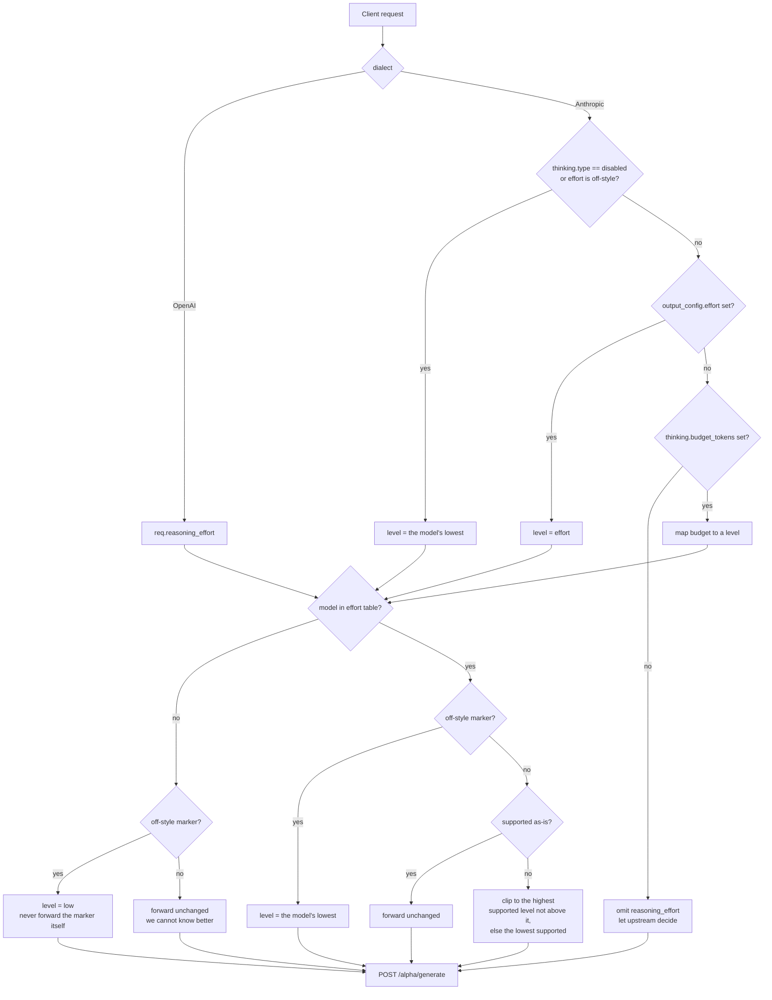

<a href="#"></a>

# Command Code API Proxy — Personal Build

个人版 fork，基于 [thaolaptrinh/commandcode-api-proxy](https://github.com/thaolaptrinh/commandcode-api-proxy)。

**把 [Command Code](https://commandcode.ai) 的订阅协议翻译成标准 OpenAI / Anthropic 接口。**
供本机 OpenCode、Claude Code、ZCode 或任意标准客户端使用。

与原版的关键差异：

- **API key 纯透传** —— 代理不存储、不管理 key。客户端每次请求带自己的 `Authorization`，
  代理原样转发给上游。没有 `auth login`、没有 `auth.json`、没有首启提示。
- **Windows 托盘 + 热更新** —— 双击即用，新版可自动接管旧版，交接期服务永不真空。
- **Rust 重写版** —— 两个原生二进制（代理 + 托盘，合计约 3 MB），不再内嵌 88 MB 的
  node 运行时；行为契约记录在 `RUST-REWRITE-SPEC.md`（含 `ADEVIATIONS.md` 的有意偏差），
  由全量测试套件保证。
- **用量台账持久化** —— 每次上游尝试一行，落 `%LOCALAPPDATA%\cc-proxy\billing.db`
  （SQLite，WAL），保留 90 天；中断的尝试记 NULL 用量，绝不记 0。

> 原版面向 npm 公开发布（含 key 托管与 `--setup-*` 引导）。本项目只服务本机，
> 那些功能已被移除，README 不再记录。

## Why?

Command Code exposes two API surfaces:

| Surface                         | Protocol                      | Plan required                   |
| ------------------------------- | ----------------------------- | ------------------------------- |
| `/provider/v1/chat/completions` | OpenAI-compatible             | **Provider** tier (paid add-on) |
| `/alpha/generate`               | Custom (Vercel AI SDK stream) | Your standard subscription      |

This proxy talks `/alpha/generate` upstream and standard OpenAI/Anthropic downstream — so your existing plan works from any tool.

## Run the proxy

```bash
git clone https://github.com/CelestNya/commandcode-api-proxy.git
cd commandcode-api-proxy
cargo build --release --locked
target/release/ccproxy.exe
```

构建需要 Rust stable（MSVC 工具链）。Windows 上推荐直接双击托盘包
（见 [Windows tray & hot-swap](#windows-tray--hot-swap)），无需自行构建。

## Authentication

**纯透传**：请求头里带什么 key，就原样转发给上游。代理自身不读取、不保存、不校验 key。

```bash
# OpenAI 格式
curl http://127.0.0.1:8787/v1/chat/completions \
  -H "Authorization: Bearer <你的 CC key>" \
  -H "Content-Type: application/json" \
  -d '{"model":"deepseek-v4-pro","messages":[{"role":"user","content":"hi"}]}'

# Anthropic 格式
curl http://127.0.0.1:8787/v1/messages \
  -H "x-api-key: <你的 CC key>" \
  -H "anthropic-version: 2023-06-01" \
  -H "Content-Type: application/json" \
  -d '{"model":"claude-sonnet-4-5","max_tokens":64,"messages":[{"role":"user","content":"hi"}]}'
```

不带 key 的请求直接得到 `401`，不会向上游发出。`Authorization: Bearer <key>` 与
`x-api-key: <key>` 两种写法都接受。

## CLI options

| Option   | Description  | Default     |
| -------- | ------------ | ----------- |
| `--host` | Bind address | `127.0.0.1` |
| `--port` | Port         | `8787`      |

Equivalent env vars (lower priority than CLI flags):

| Env var                  | Description                                                                                                             |
| ------------------------ | ----------------------------------------------------------------------------------------------------------------------- |
| `HOST`                   | Bind address                                                                                                            |
| `PORT`                   | Port                                                                                                                    |
| `CC_API_BASE`            | Upstream API base URL                                                                                                   |
| `CC_CLI_VERSION`         | CLI version sent upstream                                                                                               |
| `CC_UPSTREAM_TIMEOUT_MS` | Max ms for upstream to return response headers + first byte (default `600000` / 10 min). Bump for slow reasoning models |
| `CC_IDLE_TIMEOUT_MS`     | Max ms between consecutive stream chunks (default `120000` / 2 min). `0` disables — detects stalled upstreams           |
| `CC_MAX_BODY_BYTES`      | Max request body size (default `10485760` / 10 MiB, capped at 50 MiB). Raise for large vision/PDF payloads.             |
| `CC_NO_TOOLS_GUARD`      | Set to `off` to disable the injected "tools are disabled" instruction for tool-less chat requests.                       |
| `CC_PROXY`               | Tray only: `off` forces a direct connection, `<url>` overrides the auto-detected system proxy.                          |
| `CC_TRAY_NS`             | Tray only: namespace for a second, isolated instance (mutex/events/logs/data dir). Production stays empty.              |
| `LOG_LEVEL`              | Log level (`debug`, `info`, `warn`, `error`)                                                                            |
| `CORS_ORIGIN`            | `Access-Control-Allow-Origin` value. `*` by default; empty string disables CORS. Restrict before exposing on a network. |

> **Security:** the proxy forwards the client's Command Code key upstream, so it is
> designed for **localhost** use (`HOST=127.0.0.1`). Do not bind it to `0.0.0.0` on an
> untrusted network without restricting `CORS_ORIGIN` and putting your own auth in front.

## Endpoints

| Endpoint                         | Protocol  |
| -------------------------------- | --------- |
| `GET /health`                    | —         |
| `GET /v1/models`                 | OpenAI    |
| `POST /v1/chat/completions`      | OpenAI    |
| `POST /v1/messages`              | Anthropic |
| `POST /v1/messages/count_tokens` | Anthropic |

每个端点都要求请求头带 key（透传给上游）；缺失则本地 `401`。

## Client configuration

### OpenCode

Point a `commandcode` provider at the proxy and use any model ID from the
[Model aliases](#model-aliases) table. The `apiKey` here is placeholdered —
put your real Command Code key in it (or override via OpenCode's auth store):

```json
{
  "$schema": "https://opencode.ai/config.json",
  "provider": {
    "commandcode": {
      "npm": "@ai-sdk/openai-compatible",
      "name": "Command Code",
      "options": {
        "baseURL": "http://127.0.0.1:8787/v1",
        "apiKey": "<你的 CC key>"
      },
      "models": {
        "deepseek-v4-pro": { "name": "DeepSeek V4 Pro" }
      }
    }
  }
}
```

### Claude Code

Claude Code only offers three tiers — `sonnet`, `opus`, `haiku` — and sends
`claude-*` model IDs. The proxy maps every `claude-*` request to one CC model,
chosen by `ANTHROPIC_DEFAULT_MODEL` (or the first entry of the catalog when
unset), so all three tiers land on a model that actually works:

```bash
export ANTHROPIC_BASE_URL=http://127.0.0.1:8787
export ANTHROPIC_AUTH_TOKEN=<你的 CC key>
export ANTHROPIC_DEFAULT_MODEL=deepseek/deepseek-v4-pro
claude
```

> `ANTHROPIC_DEFAULT_MODEL` is read by **the proxy**, not by Claude Code — it
> decides which CC model a `claude-*` ID resolves to. An alias from the table
> below works too (`deepseek-v4-pro`).

## Model aliases

Short names work in addition to full model IDs:

| Alias                                            | Maps to                               |
| ------------------------------------------------ | ------------------------------------- |
| `deepseek-v4-pro`, `deepseek-v4`, `deepseek-pro` | `deepseek/deepseek-v4-pro` |
| `deepseek-v4-flash`, `deepseek-flash` | `deepseek/deepseek-v4-flash` |
| `deepseek-v4-flash-vision`, `deepseek-vision` | `deepseek/deepseek-v4-flash-vision-exp` |
| `glm-5.3`, `glm5.3` | `zai-org/GLM-5.3` |
| `glm-5.3-flash`, `glm5.3-flash` | `z-ai/glm-5.3-flash` |
| `glm-5.2`, `glm5.2` | `zai-org/GLM-5.2` |
| `glm-5.2-fast`, `glm5.2-fast` | `zai-org/GLM-5.2-Fast` |
| `glm-5.1` | `zai-org/GLM-5.1` |
| `glm-5` | `zai-org/GLM-5` |
| `minimax-m3`, `minimax3` | `MiniMaxAI/MiniMax-M3` |
| `minimax-m3-free` | `minimax/minimax-m3-free` |
| `minimax-m2.7`, `minimax2.7` | `MiniMaxAI/MiniMax-M2.7` |
| `minimax-m2.7-free` | `minimax/minimax-m2.7-free` |
| `minimax-m2.5`, `minimax2.5` | `MiniMaxAI/MiniMax-M2.5` |
| `kimi-k3`, `kimi3` | `moonshotai/Kimi-K3` |
| `kimi-k2.7-code`, `kimi2.7-code`, `kimi-code` | `moonshotai/Kimi-K2.7-Code` |
| `kimi-k2.7-highspeed`, `kimi-highspeed` | `moonshotai/Kimi-K2.7-Code-Highspeed` |
| `kimi-k2.6`, `kimi2.6` | `moonshotai/Kimi-K2.6` |
| `kimi-k2.5`, `kimi2.5` | `moonshotai/Kimi-K2.5` |
| `qwen3.8-max`, `qwen-3.8-max` | `Qwen/Qwen3.8-Max` |
| `qwen3.8-flash`, `qwen-3.8-flash` | `Qwen/Qwen3.8-Flash` |
| `qwen3.8-27b`, `qwen-3.8-27b` | `Qwen/Qwen3.8-27B` |
| `qwen3.7-max`, `qwen-3.7-max` | `Qwen/Qwen3.7-Max` |
| `qwen3.7-plus`, `qwen-3.7-plus` | `Qwen/Qwen3.7-Plus` |
| `qwen3.7-flash`, `qwen-3.7-flash` | `Qwen/Qwen3.7-Flash` |
| `qwen3.6-max`, `qwen-3.6-max` | `Qwen/Qwen3.6-Max-Preview` |
| `qwen3.6-plus`, `qwen-3.6-plus` | `Qwen/Qwen3.6-Plus` |
| `step-3.7-flash`, `step3.7` | `stepfun/Step-3.7-Flash` |
| `step-3.5-flash`, `step3.5` | `stepfun/Step-3.5-Flash` |
| `mimo-v2.5-pro`, `mimo-pro` | `xiaomi/mimo-v2.5-pro` |
| `mimo-v2.5`, `mimo2.5` | `xiaomi/mimo-v2.5` |
| `grok-4.6`, `grok4.6` | `xai/grok-4.6` |
| `grok-4.5`, `grok4.5` | `xai/grok-4.5` |
| `nemotron`, `nemotron-3-ultra` | `nvidia/nemotron-3-ultra-550b-a55b` |
| `inkling` | `thinkingmachines/inkling` |
| `inkling-small` | `thinkingmachines/inkling-small` |
| `hy4`, `hy4-preview` | `tencent/hy4-preview` |
| `hy3` | `tencent/Hy3` |
| `muse-spark`, `muse-spark-1.2` | `meta/muse-spark-1.2` |
| `muse-spark-contributor` | `meta/muse-spark-1.2-contributor` |
| `muse-spark-1.1` | `meta/muse-spark-1.1` |
| `fugu`, `fugu-ultra` | `sakana/fugu-ultra` |
| `laguna` | `poolside/laguna-s-2.1-free` |

This table is generated from `crates/ccproxy/src/models.json` (`shortAliases`) —
that file is the single source of truth.

Any model ID is passed through as-is — the proxy does not validate against a fixed list.
A bare name the catalog has not seen yet is forwarded verbatim; if CC rejects it with
`Model/provider not recognized`, the proxy refreshes the catalog from the provider API
and retries once with the resolved ID.

### Reasoning effort

Some models support a `reasoning_effort` (`low` | `medium` | `high` | `xhigh` | `max`), and
each accepts a different subset. The upstream validates the field as an enum and rejects
anything else, so the proxy resolves every request to a level the model actually accepts
before sending it.

How a client expresses the level depends on the dialect:

| Dialect | Field |
| ------- | ----- |
| OpenAI | `reasoning_effort` |
| Anthropic | `output_config.effort`, falling back to `thinking.budget_tokens` (larger budget → higher effort) |

Anthropic clients also signal "no extended thinking" with `thinking.type: "disabled"`, and
some send an off-style marker (`off` / `none` / `disabled` / `minimal`) as the effort
itself. The upstream has no such level — all of those are rejected upstream — so the proxy
resolves them to the model's lowest supported level. That is the closest expressible
intent, and it produces measurably less reasoning than omitting the field, which would
hand the choice back to the model's own default.



The model → levels table lives in the Rust crate (`crates/ccproxy/src/models.json`,
included via `include_str!`), mirroring the official CLI's embedded copy. The
upstream API does **not** report it — `/provider/v1/models` returns only
id/name/context for every model — so the table is vendored once and pinned by the
unit tests in `crates/ccproxy/src/translate/models.rs`, which fail when the two drift.

## Windows tray & hot-swap

The personal build ships a tray manager (`CCProxyTray.exe`) that runs the proxy as a
child process and supervises it. It is Windows-only and optional.

**Behavior**

- Starting the tray starts the proxy. A crash is restarted after 3s.
- The tray holds the proxy in a **Job Object**, so if the tray dies (even hard-killed)
  the child is reaped too — no orphan holding the port.
- Egress follows the **Windows system proxy** by default
  (`HKCU\...\Internet Settings`), injected into the child as
  `HTTPS_PROXY`/`HTTP_PROXY` + `NODE_USE_ENV_PROXY=1`. `CC_PROXY=off` forces a direct
  connection; `CC_PROXY=<url>` overrides the URL.
- The port is a fixed contract (`8787`). If another program holds it the tray
  **refuses to start** rather than taking it over; if one of our own stale processes
  holds it, that process is reaped first.

**Single instance & hot-swap**

Launching a new `CCProxyTray.exe` while an old one is running performs a two-phase
handover: the newcomer signals standby, the incumbent pauses the service and releases
the lock, the newcomer binds the port and verifies it serves traffic, then signals
commit and the incumbent exits. If the newcomer cannot serve within 30s it signals
abort and the incumbent resumes — **the service is never left in a vacuum**. The
incumbent only exits on commit, and is never force-killed.

**Hot-swap folder**

`build-rust.cmd` builds both binaries in release mode, runs the crate's own test
suite against the package, and publishes to your Desktop:

```
<Desktop>\CCProxy-Release\CCProxy-v<version>-rust\   this build, ready to drop in
<Desktop>\CCProxy-Release\CCProxy-current\           the active build
```

The package is two binaries (`ccproxy.exe` + `CCProxyTray.exe`) and a generated
`package.json` version file — no node runtime, no `dist/`. Passing `--promote`
switches `CCProxy-current` to the new build (the old pointer is moved aside first, so
an interrupted copy leaves `CCProxy-current-previous` recoverable); without it the
running instance is untouched. Older version folders are kept, so rolling back is
just renaming the older folder to `CCProxy-current` and launching the tray.

**Verifying a build without touching a running instance**

```cmd
set CC_TRAY_NS=verify
set CC_TRAY_PORT=8897
CCProxyTray.exe --selfcheck
```

`CC_TRAY_NS` isolates the mutex, events and log directory; `CC_TRAY_PORT` only takes
effect for a namespaced instance (production always uses 8787). `--selfcheck` exercises
the menu code path and **refuses to take over** when a tray is already running
(`SELFCHECK_SKIP`). Results are written to `selfcheck.log` next to the exe, because a
`winexe` has no console to print to.

## License

MIT
