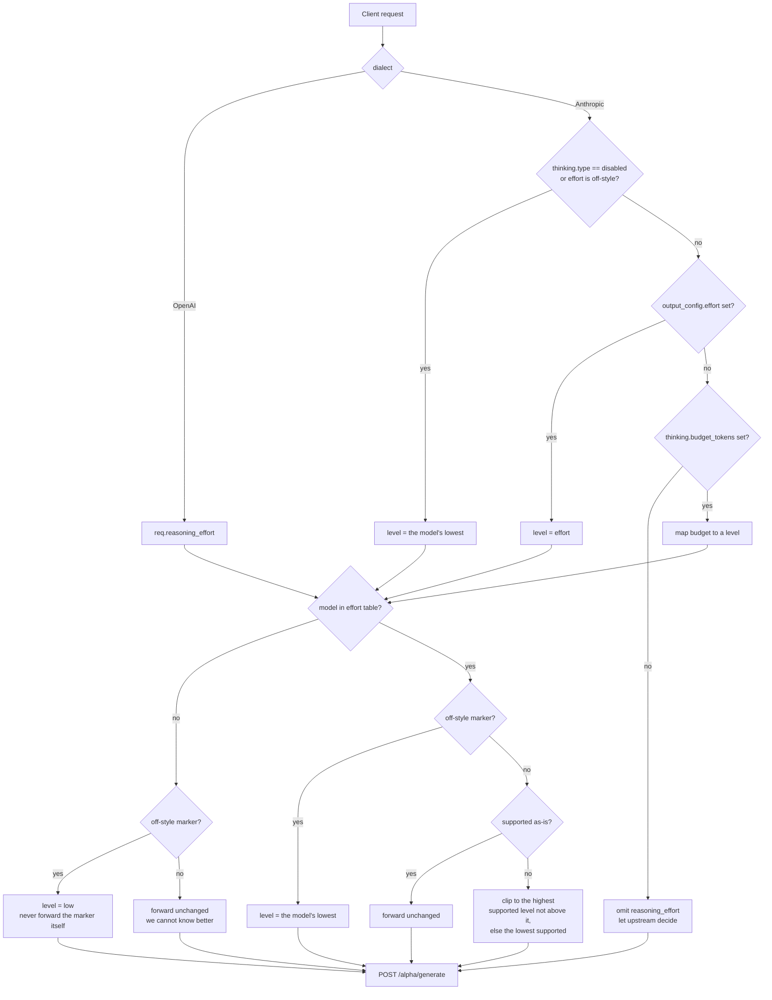

# Development

> Personal fork of [thaolaptrinh/commandcode-api-proxy](https://github.com/thaolaptrinh/commandcode-api-proxy).
> The auth subsystem (stored key, `auth` subcommand, `--setup-*` generators) has been
> removed in favour of key passthrough; the structure below reflects this fork.
>
> The Rust rewrite is complete and is the only implementation. The Node sources
> and the conformance golden that pinned behaviour against them are gone; the
> behaviour contract lives in `docs/RUST-REWRITE-SPEC.md` + `docs/ADEVIATIONS.md`,
> and the test suite in this workspace is the acceptance gate.

## Prerequisites

- Rust stable (MSVC toolchain on Windows)

## Commands

```bash
cargo build --release --locked   # Both binaries: ccproxy + CCProxyTray
cargo test                       # Unit + fixture + ledger + tray tests (303)
cargo clippy --all-targets --all-features --locked -- -D warnings   # The lint gate
cargo fmt --check
build-rust.cmd                   # Package + publish to the hot-swap folder
```

## Windows tray (Rust, `crates/ccproxy-tray`)

The tray is a second Rust binary in the same workspace, not a separate artifact.
It is Windows-only and optional: the proxy runs fine on its own.

Test a build against an isolated namespace so a running production instance is
untouched:

```cmd
set CC_TRAY_NS=verify
set CC_TRAY_PORT=8897
CCProxyTray.exe --selfcheck
```

`--selfcheck` writes results to `selfcheck.log` (a `winexe` has no console) and
refuses to take over when a tray is already running. `chaos/handover-test.py`
exercises the two-phase handover on an isolated port; it is the M6 acceptance.

### Behaviour the tray contract fixes

These are guarantees, not current implementation details — changing one is a
behaviour change, not a refactor.

- Starting the tray starts the proxy; a crash is restarted after 3s.
- The tray holds the child in a **Job Object**, so a hard-killed tray never
  orphans the proxy (see §8 for the API sequence).
- **The port is a fixed contract (`8787`).** If another program holds it the tray
  refuses to start rather than taking it over; a stale process of ours holding it
  is reaped first.
- **The service is never left in a vacuum.** The two-phase handover only exits the
  incumbent on commit; if the newcomer cannot serve within 30s it aborts and the
  incumbent resumes. The incumbent is never force-killed.
- Egress policy lives in `service/ccproxy.json` (`proxy` field): `"default"`
  probes the system proxy at startup and keeps it only if a real request
  succeeds, `"direct"` never proxies, a URL always proxies with no fallback.
  `CC_PROXY` overrides the file. Selection logic is in `src/proxy.rs`.

### Packaging and rollback

`build-rust.cmd` (no args) builds both binaries in release mode, runs
`cargo test --locked` against the package, and publishes to
`%Desktop%\CCProxy-Release\CCProxy-v<version>-rust\`. `--promote` additionally
switches `CCProxy-current` — moving the old pointer aside first, so an interrupted
copy leaves `CCProxy-current-previous` recoverable. Without `--promote` the
running instance is untouched, which is why building a candidate and switching
production are separate acts.

Older version folders are kept on purpose: rolling back is renaming the older
folder to `CCProxy-current` and launching its tray, no rebuild.

**The no-arg build must never target a live instance's directory.** It once did
(reading the version from Cargo.toml, which equalled the running folder) and
`rmdir /s /q` deleted a running install's directory; the process survived on the
mapped image with an orphaned log handle. The script now refuses when a process
is running from the target path, and swaps via a `-previous` rename.

### WebUI assembly (build-time inlining)

The panel is served as **one self-contained document** (inline CSS/JS, no sibling
requests) so it works offline and behind any client — but it is *authored* as
separate files. `build.rs` includes `src/webui_site.rs` via `#[path]` and inlines
`crates/ccproxy/webui/` into `$OUT_DIR/webui.html` at compile time:

```
crates/ccproxy/webui/
├── index.html       the composition: which CSS/JS, in what order (the only list)
├── css/             tokens, layout, content, overview, detail, log, responsive
└── js/              core, router, stats, attempts, api, logs, app
```

Editing a style means editing the one file that owns it; adding a file means
adding one line to `index.html` and nothing else. A referenced file that does not
exist fails the build rather than shipping a page quietly missing a stylesheet.

At run time the proxy prefers loose sources at `service/webui/` over the compiled
copy (`webui.rs::page`, invalidated by walking the directory's newest mtime), so
an installed copy can be edited and picked up by a reload. The startup log names
which copy is in use. Delete `service/webui/` for a smaller install; the page
keeps working from the compiled copy.

## Project structure

```
crates/
├── ccproxy/               # The proxy binary — #![forbid(unsafe_code)]
│   ├── src/
│   │   ├── main.rs          # Entry: config, server startup, signal handling
│   │   ├── lib.rs           # The library surface the binary and tests share
│   │   ├── config.rs        # Config loader (env + CLI + ccproxy.json, clamping)
│   │   ├── proxy.rs         # Outbound egress: proxy policy, probe, per-URL agent
│   │   ├── log.rs           # Level-filtered logger
│   │   ├── dump.rs          # Failed-request dumps
│   │   ├── server.rs        # HTTP server, routing, CORS, body limits, reject log
│   │   ├── generate.rs      # Request lifecycle: model discovery + retry layers
│   │   ├── stream_body.rs   # Downstream SSE loop, splice retry, terminal records
│   │   ├── upstream.rs      # CC /alpha/generate client, TransportFault classes
│   │   ├── ndjson.rs        # CC NDJSON line parsing
│   │   ├── sse.rs           # SSE framing, StreamFailure classification
│   │   ├── billing.rs       # Per-attempt SQLite ledger + writer thread
│   │   ├── pricing.rs       # Cost table (crawled rates, embedded RSC JSON)
│   │   ├── webui.rs         # WebUI routes, stats/attempts/log APIs, SSE stream
│   │   ├── webui_site.rs    # Page assembly (shared by build.rs and run time)
│   │   ├── cli_version.rs   # Startup CLI-version lookup (with retry)
│   │   ├── models.rs        # Model resolution, aliasing, reasoning effort
│   │   ├── catalog.rs       # Dynamic model catalog (provider API + static merge)
│   │   ├── time.rs          # Clock helpers (testable)
│   │   ├── validation.rs    # Request validation (OpenAI + Anthropic)
│   │   ├── tool_arguments.rs
│   │   ├── usage.rs         # /health cache stats
│   │   ├── models.json      # Vendored model table (aliases, efforts, context)
│   │   └── translate/       # openai.rs, anthropic_stream.rs, openai_stream.rs,
│   │                        #   nonstream.rs, models.rs, terminal.rs, util.rs
│   └── webui/               # Panel sources, inlined at build time (css/, js/, index.html)
└── ccproxy-tray/          # The tray binary — #![deny(unsafe_code)], FFI sites expect()
    └── src/
        ├── main.rs          # Role determination + handover loop
        ├── win.rs           # The only unsafe surface: job objects, mutex/events,
                              #   GetExtendedTcpTable, Shell_NotifyIcon, registry
        ├── owner.rs         # Handover verdict state machine (pure)
        ├── portguard.rs     # Port ownership policy (free/ours/foreign)
        ├── process.rs       # Child supervision, log rotation, egress env
        ├── tray.rs          # Menu, icon, UI state
        └── health.rs        # /health probe for the handover gate
build-rust.cmd             # Packaging + hot-swap publish (root; the release gate)
chaos/                     # Handover and soak scripts (manual, Python)
docs/
├── DEVELOPMENT.md               # This file
├── RUST-REWRITE-SPEC.md         # Behaviour contract (historical spec)
├── ADEVIATIONS.md               # Intentional deviations from the Node version
├── adr/                         # Architecture decision records (start here for "why")
└── archive/                     # Superseded working documents
```

## Tech stack

- **Language:** Rust (edition 2021), blocking thread-per-connection — no async runtime (see §4)
- **HTTP:** `tiny_http` (server) + `ureq` (client)
- **Storage:** `rusqlite` (bundled SQLite, WAL)
- **JSON:** `serde_json`
- **Test:** plain `#[test]` — unit, integration and fixture-replay suites

# Rust rewrite — engineering rules

Target: port this proxy to Rust, keeping the behaviour recorded in
`docs/RUST-REWRITE-SPEC.md` + `docs/ADEVIATIONS.md` (the Node version and its golden are
gone; the Rust test suite is the acceptance gate). These rules are the project's
Rust standard; they are normative for every crate in the workspace. Sources are
the Rust API Guidelines, the
Clippy lint reference, and the Tokio documentation, plus the conventions that
the community's better Rust skills converge on — no skill file is vendored.

## 1. Crate layout and unsafe

Two crates, split by where `unsafe` is allowed to live. This is what makes
`forbid(unsafe_code)` possible for everything that is not Win32 FFI.

| Crate | Contents | Unsafe policy |
| ----- | -------- | ------------- |
| `ccproxy` (bin) | Translation, NDJSON/SSE encoding, model catalog, config, HTTP server, billing ledger | `#![forbid(unsafe_code)]` |
| `ccproxy-tray` (bin) | Job Objects, mutex/event handover, `GetExtendedTcpTable`, tray UI, registry | `#![deny(unsafe_code)]` — all `unsafe` confined to `win.rs` |

- `forbid` cannot be lowered by a nested `#[allow]` — attempting it is itself a
  compile error, which is the point.
- Use `deny`, not `forbid`, inside `ccproxy-tray`, so each FFI site can carry
  `#[expect(unsafe_code)]` plus a comment naming the invariant it upholds.
- Do not use `unsafe` to work around the borrow checker. If a data structure
  needs it, find the safe abstraction first.

## 2. Lints — the gate

```bash
cargo clippy --all-targets --all-features --locked -- -D warnings
cargo fmt --check
```

Default-on groups (`correctness`, `suspicious`, `style`, `complexity`, `perf`)
are already a hard error under `-D warnings`. Additionally deny these, which are
off by default:

```rust
#![deny(
    clippy::unwrap_used,
    clippy::expect_used,
    clippy::panic,
    clippy::indexing_slicing,
    clippy::arithmetic_side_effects,
    clippy::as_conversions,
    clippy::todo,
    clippy::unimplemented,
    clippy::dbg_macro,
)]
```

- Cherry-pick from `pedantic`; never enable the group wholesale. Useful picks:
  `cast_possible_truncation`, `must_use_candidate`, `missing_errors_doc`.
- Never enable `restriction` as a group — Clippy warns if it finds
  `#![warn(clippy::restriction)]`.
- `indexing_slicing` will fire constantly in the NDJSON parser. Keep the crate
  deny and use `#[expect(clippy::indexing_slicing)]` on the few hot functions
  where the bound is locally provable, with a comment saying why.
- Prefer `#[expect(lint)]` over `#[allow(lint)]`: `expect` warns when the lint
  stops firing, so stale suppressions cannot rot silently.
- Route all output through `log.rs` (the level-filtered logger). Never print
  from request-handling code — the two-line request lifecycle log is a contract,
  and stray stdout would corrupt it.

## 3. Errors

A proxy is both a library and a binary, so both idioms apply to different parts.

- **Errors are typed enums, defined in the module that produces them.**
  `UpstreamError` (with `TransportFault`) and `TranslateError` live beside the
  code that raises them. There is no `thiserror` dependency and no separate
  `ccproxy-core` crate: the workspace is `ccproxy` + `ccproxy-tray`, and the
  error types are hand-written. (An earlier plan called for `thiserror` and a
  `-core` split; neither shipped, and this section claimed otherwise until
  2026-09-23.)
- **Errors carry the data needed to build a response.** A bare
  `UpstreamStatus(code)` loses the body CC sends with the reason; a bare
  `status_code: 0` loses which transport failure happened. The second case is
  why `UpstreamError` carries `fault: Option<TransportFault>`.
- **Classify by structure, never by message text.** `ureq` appends the OS error
  verbatim and the OS localises it, so matching English words in a message is
  silently wrong on a non-English machine — it filed every timeout as a network
  error for the ledger's entire history. Read `ErrorKind` and the `source()`
  chain instead. See `adr/0001-transport-failure-classification.md`.
- **`anyhow` is not a dependency and errors are not `anyhow`-based.** The binary
  unwraps its own typed errors at the boundary; nothing here needs dynamic error
  packaging, and adding it would erase the classes above.
- **One place decides the status code.** `UpstreamError::downstream_status` is
  the single mapping (4xx passes through, everything else collapses to 502), and
  the per-dialect envelope shape lives in `server.rs`. That is where HTTP
  semantics live, and the place to diff against the `failure/*` fixtures.
- **Never let an error type leak the API key.** CC's error bodies are echoed
  downstream; scrub `Bearer …` and control characters (pinned by tests).
- Log at the boundary only — one `error!` where the request fails, not in the
  translation layer.
- **Every upstream failure carries a class tag**, and the same spelling appears
  in two places: bracketed in the log line, and as the ledger's `errorTag`. A
  new failure path must attach a tag, or it becomes the one row nobody can
  group. The vocabulary is in the README's *Failure classification*.

## 4. Concurrency: threads, not async

**The project is blocking, thread-per-connection, with no tokio anywhere.** This
is a deliberate decision (see `docs/RUST-REWRITE-SPEC.md` §5.5), not an oversight —
do not introduce an async runtime later without revisiting it.

Rationale, measured: the proxy is a pure I/O forwarder with few, long-lived
connections. Production runs about one request per 35 seconds with a peak of 32
concurrent, and a blocked thread costs 24 KB RSS and **zero CPU** (measured over
1000 idle blocked threads). The machine has 16 logical cores; the other target
has 4. Threads are ample, and choosing them removes a whole class of complexity
rather than adding cost:

| Removed by not using async | Why it mattered here |
| -------------------------- | -------------------- |
| `select!` cancellation safety | The subtle hazard for a streaming proxy: a signal branch winning mid-read loses bytes or desynchronises the NDJSON parser. `read_exact` / `read_to_end` / `write_all` are not cancellation-safe. With blocking reads there is no cancellation to reason about |
| `spawn_blocking` wrapper | `rusqlite` is synchronous; under threads it is used directly |
| Runtime shutdown hangs | No runtime to shut down; the writer thread is joined explicitly |
| `Send + 'static` bounds | Shared state needs only `Arc` plus a lock |

Rules that follow:

- **One thread per connection, with a hard cap** (64). Past the cap, refuse the
  connection rather than queueing — the failure mode being defended against is
  a slow or malicious client holding a thread forever, not throughput.
- **Reduce the stack size** (`std::thread::Builder::stack_size`, 512 KB instead
  of the 2 MB default). 64 threads then cost ~1.5 MB rather than ~128 MB.
- **Do not add a total-duration cap on a request.** The only timeouts are the
  header deadline and the byte-interval idle timeout. A legitimate long
  generation must never be cut off mid-answer; that is the worst possible
  failure (content already delivered, retry starts over and is billed again).
  Measured production data confirms long turns are real.
- **Backpressure is implicit.** A slow downstream client blocks the thread in
  `write`, which stops reads from upstream and lets TCP windowing slow the
  source. Do not buffer to "avoid blocking" — that turns backpressure into
  unbounded memory growth.
- **Never hold a lock across a blocking I/O call.** Take the lock, copy what is
  needed, release, then do I/O.
- **Sharing state:** immutable config behind `Arc`; the model catalog behind
  `RwLock` (read-mostly) or `arc-swap`; the usage writer receives records over a
  bounded `std::sync::mpsc` channel from a dedicated writer thread that owns the
  connection. `try_send` only — a full channel drops the record and counts it,
  never blocks the request path.
- **Graceful shutdown:** stop accepting, then let in-flight responses finish
  with a bounded grace period, then exit. Do not put draining in a `Drop` impl —
  destructors must not block (API Guidelines `C-DTOR-BLOCK`).

## 5. HTTP and streaming

Stack, all blocking (the finished proxy binary is 3.2 MB with the whole stack
linked in, against 88 MB for the bundled Node runtime):

| Layer | Choice | Why |
| ----- | ------ | --- |
| Server | `tiny_http` | API is "a request comes in, you return a response" — no async runtime, no extractor machinery to learn |
| Client | `ureq` | Blocking, TLS-capable, streams the response body |
| Storage | `rusqlite` (bundled) | Synchronous, fits the thread model directly |
| JSON | `serde_json` | See below |

- **Do not reach for `simd-json` or `sonic-rs`.** The work here is per-line,
  small objects — exactly where SIMD parsers gain least. `simd-json` mutates
  buffers in place and is substantially `unsafe`; `sonic-rs` needs
  `-C target-cpu=native` and is not universally faster on serialise. Revisit
  only with a `criterion` benchmark proving a win.
- **Write each SSE record completely, then flush.** One record is `event:` line
  + `data:` line + **a blank line**; the blank line is what dispatches the event,
  and per the WHATWG spec *"once the end of the file is reached, any pending
  data must be discarded"*. Ending the response right after a `data:` line
  silently drops the final event — plausibly `message_stop`, which looks exactly
  like a turn stopping with no message. This is the single easiest thing to get
  wrong when rewriting the write loop.
- **`[DONE]` must be bare and standalone.** The OpenAI Node SDK compares for
  equality, so a trailing space makes it attempt `JSON.parse("[DONE] ")` and
  throw.
- **Derive the SSE `event:` name and the payload `type` from one constructor.**
  They must always agree, because the Anthropic SDKs dispatch on the event name
  (a whitelist that drops unknown names *silently*) while the Vercel AI SDK
  ignores the event name entirely and validates `type` against a Zod union.
  They are exact inverses; only emitting both consistently satisfies both. The
  Node version achieved this by discipline — the Rust version should make it
  impossible to violate.
- **Consider `KeepAlive` comment pings** if the deployment sits behind an
  intermediary that closes idle connections. The Node version relies on the
  client's own timeout, and no intermediary has caused a problem so far.

### Reasoning-effort resolution

Some models support a `reasoning_effort` (`low` | `medium` | `high` | `xhigh` |
`max`), and each accepts a **different subset**. The upstream validates the field
as an enum and rejects anything else, so every request is resolved to a level the
model actually accepts before it is sent. The resolution table is vendored in
`src/models.json` (`include_str!`), mirroring the official CLI's embedded copy;
`/provider/v1/models` does **not** report it, so the table cannot be discovered at
run time. `translate/models.rs` pins it with tests that fail when the two drift.

How a client expresses the level depends on the dialect:

| Dialect | Field |
| ------- | ----- |
| OpenAI | `reasoning_effort` |
| Anthropic | `output_config.effort`, falling back to `thinking.budget_tokens` (larger budget → higher effort) |

Anthropic clients also signal "no extended thinking" with `thinking.type:
"disabled"`, and some send an off-style marker (`off` / `none` / `disabled` /
`minimal`) as the effort itself. The upstream has no such level — all of those are
rejected upstream — so they resolve to the model's lowest supported level. That
is the closest expressible intent, and it produces measurably less reasoning than
omitting the field, which would hand the choice back to the model's default.



## 6. Testing

- **Plain `#[test]` everywhere** — there is no async runtime to bridge, so no
  `#[tokio::test]` is needed. Snapshot/property tooling (`insta`, `proptest`) and
  extra runners (`nextest`, `cargo-deny`) were considered and deliberately
  dropped: `cargo test` covers everything they would, at none of their setup cost.
- **The fixture-replay suites are the primary acceptance tests.** The recorded
  transcripts live in `crates/ccproxy/tests/fixtures/` (moved out of the retired
  conformance golden): `translate_golden.rs` replays all 52 translation
  samples, `stream_golden.rs` replays every stream transcript against both
  encoders.
- **Stream invariants the fixtures cannot see** are pinned by hand-rolled tests
  (`crates/ccproxy/tests/stream_body.rs`): byte-offset stream splits, block
  lifecycle (no delta before `content_block_start`, no record after
  `message_stop`), and the splice-retry transcripts.
- **The billing ledger is tested at both levels:** writer unit tests
  (numbering, NULL-vs-zero, backpressure drop, flush) and end-to-end fault
  injection driving real turns through the server with the ledger removed or
  broken (`crates/ccproxy/tests/billing_ledger.rs`).
- **Transport classification has two layers of tests, by design.** The decision
  itself is a pure function (`upstream.rs::fault_from` over `ureq::ErrorKind`,
  `io::ErrorKind`, the egress `Route`), pinned by a table test covering every
  branch — including shapes a real socket cannot reliably produce (a NAT gateway
  answering a connect with RST). Around it, real-socket smoke tests stand up a
  listener that accepts and then stalls, a dead port, and a reserved TLD, so a
  change in ureq's own error structure cannot go unnoticed: a hand-built error
  would encode whatever the test expects, which is exactly how the old
  message-matching classifier looked correct in review. Locale-independence is
  pinned structurally — a chain walk test whose fixture carries the
  Chinese-locale timeout text (no English word to match) and asserts the kind
  is still recovered. Network-dependent tests are not acceptable in this suite:
  the `10.255.255.1` connect-timeout test existed for one round and was replaced
  by the table.
- **The regression gate for every commit:** `cargo fmt --check` +
  `cargo clippy --all-targets -D warnings` + `cargo test`. (The conformance
  harness and its `record.mjs --check` step are gone with the Node sources; the
  fixture-replay suites above are the acceptance gate now.) Note the CI quality
  job also runs `clippy --all-features` on **ubuntu**, which catches Windows-only
  helpers that are dead code on Linux — `-D warnings` then fails the build, and
  a local Windows-only clippy pass is not evidence about that half of the gate.

## 7. Naming and API shape

Per the Rust API Guidelines, applied to an application:

- `as_` for a cheap borrow, `to_` for an expensive conversion, `into_` when
  ownership is consumed. No `get_` prefix on accessors.
- Arguments convey meaning through types, not `bool`/`Option` (`C-CUSTOM-TYPE`).
  A `stream: bool` parameter becomes an enum.
- Validate config once at startup, not per request. The Node version parses and
  clamps all bounds in `loadConfig()`; do the same.
- Do not add `new_`-prefixed free functions; constructors are inherent methods.
- Borrow (`&str`, `&[T]`) unless ownership transfer is needed. Reach for
  `Cow<'_, T>` when ownership is genuinely ambiguous.
- Comments explain *why*; doc comments explain *what*. Every `TODO` links an
  issue.

## 8. Windows, tray, and binary size

- **Decision made: raw `windows-sys`, no typed `windows` crate.** The tray's FFI
  surface is about a dozen well-understood calls, all confined to
  `ccproxy-tray/src/win.rs`; the typed crate would have generated far more
  compile time than it saved. `windows-sys` was already in the lock file via
  `rusqlite`. Pin the version — it moves fast.
- Features are opt-in per API namespace. `CreateJobObjectW` needs
  `Win32_Security` in addition to `Win32_System_JobObjects`; this is discovered
  at compile time and is easy to miss.
- **The tray is raw Shell_NotifyIcon plus a hidden message window** — no
  `tray-icon`/`tao`/`winit`. The menu, icon (GDI-drawn dots) and the handover
  state machine together are smaller than any windowing dependency would have
  been. Win32 mutexes are thread-affine, so the mutex has a dedicated ownership
  thread; releasing it from another thread fails silently.
- **Job Object for child lifetime:** `CreateJobObjectW` →
  `SetInformationJobObject(JobObjectExtendedLimitInformation)` with
  `JOB_OBJECT_LIMIT_KILL_ON_JOB_CLOSE` → `AssignProcessToJobObject` → hold the
  handle for the tray's lifetime. Closing the last handle kills the tree, so a
  hard-killed tray never orphans the proxy. Association cannot be broken once
  set.
- **Named mutex alone is not enough for handover.** The documented caveat is
  that a malicious process can create the mutex first and block startup. Pair it
  with a named event the incumbent waits on, and namespace per user
  (`Local\`, not `Global\`, or fast user switching collides).
- **`GetExtendedTcpTable`** needs the two-call pattern: call with a too-small
  `pdwSize` to get `ERROR_INSUFFICIENT_BUFFER` and the real size, then call
  again. AF_INET6 requires a `_OWNER_PID_*` table class — the `BASIC` classes
  return `ERROR_NOT_SUPPORTED`.
- **`#![windows_subsystem = "windows"]`** at the crate root only, so no console
  appears. stdout is then unavailable — `--selfcheck` writes `selfcheck.log`
  next to the exe.
- **Tray:** `tray-icon` needs an event loop running on its thread. `tao` is the
  Tauri-aligned choice; `winit` has wider adoption. Taking a full windowing
  dependency for an icon is heavy — calling the shell APIs directly through
  `windows-sys` is viable if the tray stays minimal.
- **Size profile** — the whole reason for the rewrite is the 88 MB Node runtime,
  so lock this in:

  ```toml
  [profile.release]
  opt-level = "s"    # "s" often beats "z"; "z" also disables loop vectorisation
  lto = true
  codegen-units = 1
  panic = "abort"    # removes backtraces — weigh against log-only diagnostics
  strip = true
  ```

  Measured on this machine: a hello-world binary is 1.17 MB default and 245 KB
  with this profile; the finished binaries are **3.2 MB** (`ccproxy.exe`) and
  **1.4 MB** (`CCProxyTray.exe`) — against 88 MB for the bundled Node runtime
  the rewrite replaces. `panic = "abort"` does not apply to test/bench profiles
  — Cargo forces unwind there. It also removes backtraces, which matters for a
  tray app whose only diagnostic channel is a log file; weigh that if field
  crashes become hard to diagnose.

